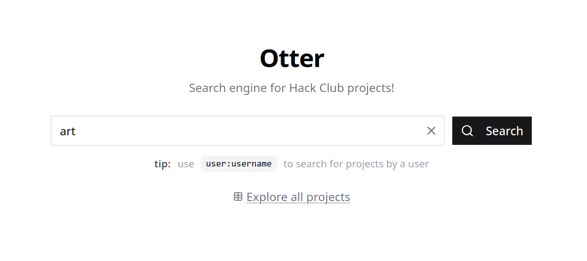

# Otter



---

## Development

Make sure you have [Docker](https://www.docker.com), [Rust](https://www.rust-lang.org) and [Bun](https://bun.sh) installed.

```bash
# Start Postgres and Redis
docker compose up -d

# Start the backend
cd app
cargo run

# Start the frontend
cd frontend
bun i
bun dev
```

These should now be live:

- **frontend**: [http://localhost:5173](http://localhost:5173)
- **backend**: [http://localhost:3000](http://localhost:3000)
