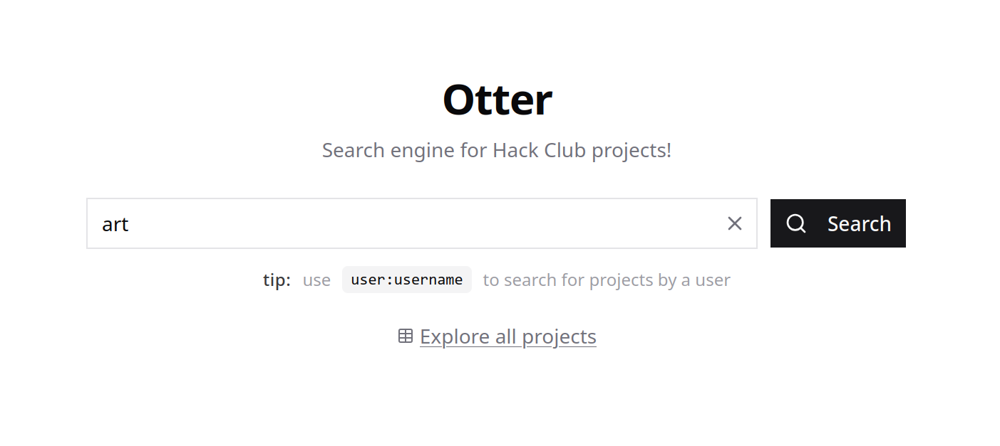

<p align="center">
    
</p>
<h1 align="center" style="font-size: 52px; font-family: 'system-ui';">Otter</h1>
<p align="center">
    <a href="https://github.com/ImShyMike/otter/actions"></a>
    <a href="https://github.com/ImShyMike/otter/stargazers"></a>
    <a href="https://github.com/ImShyMike/otter/commits/main"></a>
    <a href="https://github.com/ImShyMike/otter"></a>
    <a href="https://github.com/ImShyMike/otter/blob/main/LICENSE"></a>
</p>

An easy-to-use search engine/API for all Hack Club projects, built with Rust, Svelte and Postgres. Projects are ingested from the [Ships API](https://github.com/hackclub/ships) and [Airbridge](https://github.com/hackclub/airbridge), and are then indexed and stored in the database.

## API Documentation

Documentation for the API can be found at [https://otter.shymike.dev/docs](https://otter.shymike.dev/docs)! (or [http://localhost:3000/docs](http://localhost:3000/docs) when running locally)

## Development

Make sure you have [Docker](https://www.docker.com), [Rust](https://www.rust-lang.org) and [Bun](https://bun.sh) installed.

```bash
# Start Postgres and Redis
docker compose up -d

# Start the backend
cd app
cargo run

# Start the frontend
cd frontend
bun i
bun dev
```

These should now be live:

- **frontend**: [http://localhost:5173](http://localhost:5173)
- **backend**: [http://localhost:3000](http://localhost:3000)

## Star History

<a href="https://www.star-history.com/?repos=ImShyMike%2Fotter&type=date&legend=top-left">
 <picture>
   <source media="(prefers-color-scheme: dark)" srcset="https://api.star-history.com/chart?repos=ImShyMike/otter&type=date&theme=dark&legend=top-left" />
   <source media="(prefers-color-scheme: light)" srcset="https://api.star-history.com/chart?repos=ImShyMike/otter&type=date&legend=top-left" />
   
 </picture>
</a>
